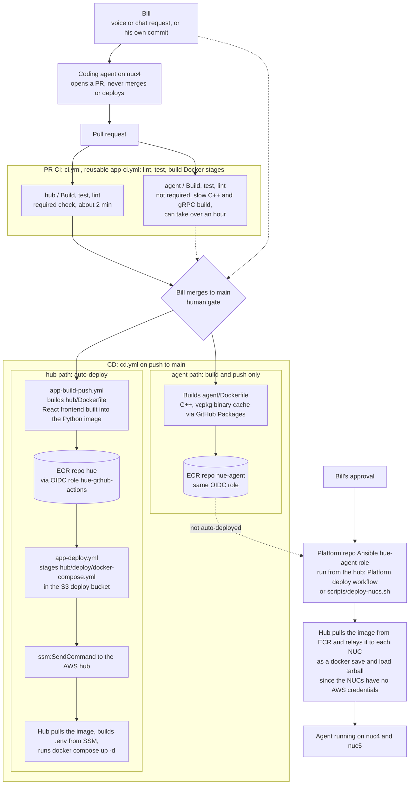
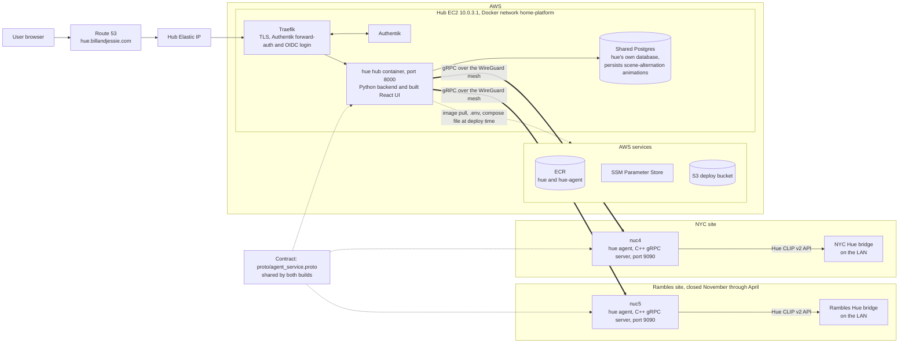

# hue architecture

`hue` is a household Hue lighting controller made of two components: a Python hub that runs on the AWS hub behind Traefik and Authentik, and a C++ agent on each site's NUC that is the only thing talking to that site's Hue bridge. This page shows how changes get from a request to production, and how the pieces are wired together at runtime. For the platform mechanics (reusable workflows, OIDC roles, SSM, Traefik, Authentik) see the platform repo's [`docs/app-platform.md`](https://github.com/bcalaway/nyc_pa_aws_gitops/blob/main/docs/app-platform.md) rather than re-reading them here.

## DevOps workflow

- The coding agent only ever opens PRs. Merging is Bill's call, and nothing deploys without a merge to main.
- Only `hub / Build, test, lint` is a required check. The agent job is slow and can run over an hour, so it does not block merging.
- The hub path is fully automatic: merge, build, push, stage, and `docker compose up -d` with no further approval.
- The agent image is pushed to ECR on every merge but never reaches the NUCs on its own. Rolling it out is a separate, approved Ansible run.
- Both ECR repos use the same `hue-github-actions` role, so there is one OIDC trust even though the deploy paths differ.

## Infrastructure

- Browsers only ever reach Traefik, which terminates TLS and checks Authentik before forwarding to the hub container on port 8000.
- The hub talks to each agent over gRPC across the WireGuard mesh. Agents are never exposed through Traefik or the internet.
- Each agent talks to its local bridge over the Hue CLIP v2 API. The hub never talks to a bridge directly.
- Scene-alternation animations are stored in hue's own database on the shared Postgres, so they survive a hub redeploy.
- The Rambles site is closed November through April, so its agent and bridge may be unreachable in that window.
- `proto/agent_service.proto` is the contract between hub and agent, shared by the Python and C++ builds.
